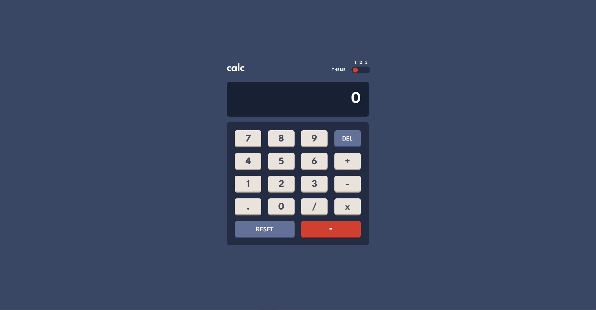

# Frontend Mentor - Calculator app solution

This is my solution to the [Calculator app challenge on Frontend Mentor](https://www.frontendmentor.io/challenges/calculator-app-9lteq5N29).

## Table of contents

- [Overview](#overview)
  - [The challenge](#the-challenge)
  - [Screenshot](#screenshot)
  - [Links](#links)
- [My process](#my-process)
  - [Built with](#built-with)
  - [What I learned](#what-i-learned)
  - [Continued development](#continued-development)

## Overview

### The challenge

Users should be able to:

- See the size of the elements adjust based on their device's screen size
- Perform mathmatical operations like addition, subtraction, multiplication, and division
- Adjust the color theme based on their preference

### Screenshot

### Links

- Solution URL: [https://github.com/andy-devs/calculator-app](https://github.com/andy-devs/calculator-app)
- Live Site URL: [https://calculator-app-peach.vercel.app/](https://calculator-app-peach.vercel.app/)

## My process

### Built with

- [TypeScript](https://www.typescriptlang.org/)
- [React](https://reactjs.org/) - JS library
- [Mantine](https://mantine.dev/) - UI Library

### What I learned

I've started this projects to try TypeScript for the first time. I've learned how to use it with React a little bit better.

### Continued development

I think I'll continue practicing React and I'll try to implement bigger projects with it.
